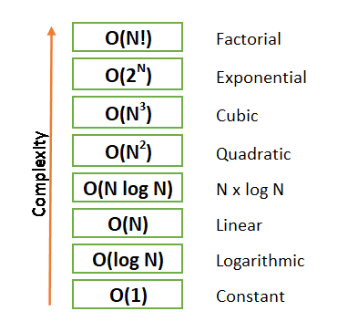

# Pain is a way to growth

## Big o

Big o to describe the performance or complexity of an algorithm in cs and can be used to describe the execution time required or the space used by an algorithm.

- O (1) fixed performance algorithm take same time or space regardless the size of input data
- O(n) linearly performance grow with the size of data  
- O(n^2) proportional to the square of the size of data input
- O(2^n) performance growth doubles with each addition of data input
- O (log n) efficient when dealing with large data sets. Since its growth curve peaks at the beginning and slowly flattens out as the size of the data sets increase(ex:binary search for data)

** Variable and how it saved in the memory /variable never copy data /mutable and immutable variable

    - In python memory management is done automatically done by memory manager.
    - Memory management also involves cleaning memory of object that no longer accessed by any reference.
    - The process of cleaning memory of unreferenced object is called as garbage collection.
" <https://medium.com/@codingpilot25/how-does-variable-and-function-stored-in-python-3916c64fb983>"

Computer memory is like a cupboard filled with storage jars. Using Python, you put values in the jars and then you put a label, a variable, on the jar, so you can find your value later.

example:

    crunchy = 7
    peanut_butter = crunchy
    peanut_butter
    >>>7
    crunchy
    >>> 7
    # Watch what happens if we change crunchy back to 5
    crunchy = 5
    crunchy
    >>>5
    peanut_butter
    >>>7
