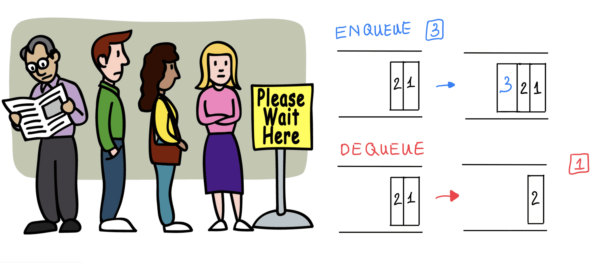

# Stacks and Queues

## stack

(FILO,LIFO)

Stack is a linear data structure that consists of Nodes. Each Node references the next Node in the stack, but does not reference its previous

### Method in stack

- Push - Nodes or items that are put into the stack are pushed
- Pop - Nodes or items that are removed from the stack are popped. `When you attempt to pop an empty stack an exception will be raised`.
- Top - This is the top of the stack.
- Peek - When you peek you will **view the value of the top Node in the stack**. `When you attempt to peek an empty stack an exception will be raised`.
- IsEmpty -checking for stack if its empty or not it returns true when stack is empty otherwise it returns false.

### Time Complexities of operations on stack

push(), pop(), isEmpty() and peek() all take O(1) time. We do not run any loop in any of these operations.

FILO (First In Last Out)

This means that the first item added in the stack will be the last item popped out of the stack.

LIFO (Last In First Out)

This means that the last item added to the stack will be the first item popped out of the stack.

## Queue

(FIFO,LILO)

 Queue is a linear structure which follows a particular order in which the operations are performed. The order is First In First Out (FIFO).

 A good example of a queue is any queue of consumers for a resource where the consumer that came first is served first.

 The difference between stacks and queues is in removing. In a stack we remove the item the most recently added; in a queue, we remove the item the least recently added.

Operations on Queue:
Mainly the following basic operations are performed on queue:

- Enqueue: Adds an item to the queue. If the queue is full, then it is said to be an Overflow condition.
- Dequeue: Removes an item from the queue. The items are popped in the same order in which they are pushed. If the queue is empty, then it is said to be an Underflow condition.
- Front: Get the front item from queue.
- Rear: Get the last item from queue.
- Peek - When you peek you will view the value of the front Node in the queue. If called when the queue is empty an exception will be raised.
- IsEmpty - returns true when queue is empty otherwise returns false.

some shortcut terminology for adding and removing

FIFO (First In First Out)

This means that the first item in the queue will be the first item out of the queue.

LILO (Last In Last Out)

This means that the last item in the queue will be the last item out of the queue.

