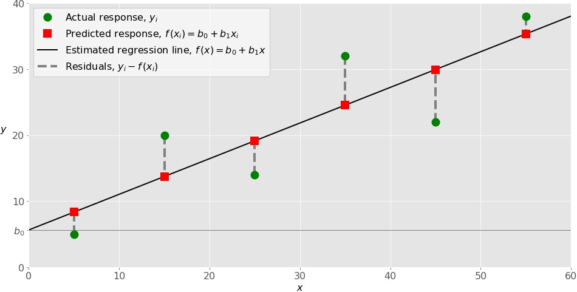

# How to run Linear regression in Python scikit-Learn

Regresion analysis explores the relationship between a quantitative response variable and one or more explanatory variables (if there is one explanatory variable it called linear regression and if more it called multiple regression)  

linear relation in math
y|x = y_intersect +slope*x

to predect the value of y at a given x value you will make a relation between them one of these relation is the linear relationship and to count the error we can add e as random error component

When Do You Need Regression?

Typically, you need regression to answer whether and how some phenomenon influences the other or how several variables are related

Linear regression is implemented with the following:

- scikit-learn if you don’t need detailed results and want to use the approach consistent with other regression techniques
- statsmodels if you need the advanced statistical parameters of a model

When performing linear regression in Python, you can follow these steps:

- Import the packages and classes you need
- Provide data to work with and eventually do appropriate transformations
- Create a regression model and fit it with existing data
- Check the results of model fitting to know whether the model is satisfactory
- Apply the model for predictions
