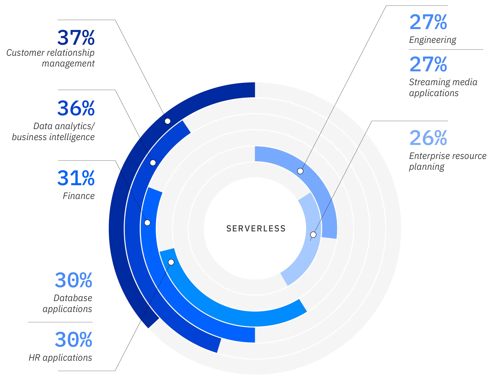

# Serverless

Serverless is a cloud computing execution model that:

- Automatically provisions the computing resources required to run application code on demand, or in response to a specific event;
- Automatically scales those resources up or down in response to increased or decreased demand;
- Automatically scales resources to zero when the application stops running.

The term 'serverless' describes the customer's experience with those servers: they are invisible to the customer, who doesn't see them, manage them, or interact with them in any way.

## Serverless vs. FaaS (function as a service)

Serverless and function as a service (FaaS) are often conflated. But FaaS is actually a subset of serverless - it's the compute paradigm central to serverless, wherein application code or containers run only in response to events or requests. Serverless includes FaaS plus all the other associated resources and cloud services and resources supporting the code - e.g. storage, databases, networks, API gateways, authentication - for which configuration, management and billing of services are invisible to the user.

## Serverless pros and cons

### pros

Serverless offers a number of individual technical and business benefits:

- As noted above, serverless enables development teams to focus on writing code, not managing infrastructure. It gives developers much more time to innovate and optimize their front-end application functionality and business logic.

- serverless customers pay for execution only. The meter starts when the request is made, and ends when execution finishes. Compare to the infrastructure as a service (IaaS) compute model, where customers pay for the virtual machines (VMs) and other resources required to run applications, from the time they provision those resources until the time the customer explicitly decommissions those resources.

- Serverless is a polyglot environment, enabling developers to code in any language or framework - Java, Python, node.js - with which they're comfortable.

- Serverless simplifies deployment and, in a larger sense, simplifies DevOps cycles, because developers don't have to describe infrastructure needed integrate, test, deliver and deploy code builds into production.

- For certain workloads, such as ones that require parallel processing, serverless can be both faster and more cost-effective than other forms of compute.

- Serverless application development platforms provide near-total visibility into system and user times, and can aggregate that information systematically.

### Cons

- Stable or predictable workloads: Because serverless scales up and down on demand in response to workload, it offers significant cost savings for spiky workloads. But it does not offer the same savings for workloads characterized by predictable, steady or long-running processes; in these cases a traditional server environment might be simpler and more cost-effective.

- Cold starts: Because serverless architectures forgo long-running processes in favor of scaling up and down to zero, they also sometimes need to start up from zero to serve a new request. For certain applications, this startup latency isn’t noticeable or detrimental to users. But for others - for example, financial trading application - the delay is unacceptable.

- Monitoring and debugging: These operational tasks are challenging in any distributed system, but a move serverless architecture (or microservices architecture, or a combination of the two) only exacerbates the complexity. For example, teams may find it difficult or impossible to monitor or debug serverless functions using existing tools or processes.

- Vendor lock-in: Serverless architectures are designed to take advantage of an ecosystem of managed cloud services and, in terms of architectural models, go the furthest to decouple a workload from something more portable, like a virtual machine (VM) or Docker container. For some companies, deeply integrating with the native managed services of a specific cloud platform is where much of the value of cloud can be found; for others, this cloud lead to material lock-in risks that need to be mitigated.

While FaaS, Platform as a Service (PaaS), containers, and virtual machines (VMs) all play a critical role in the serverless ecosystem, FaaS is the core compute model for serverless. For that reason, it's useful to explore how FaaS differs from the other compute models available across some key attributes:

- Provisioning time: Measured in milliseconds for FaaS, vs. minutes to hours for the other models.
- Ongoing administrative burden: None for FaaS, compared to continuum from light to heavy for PaaS, containers and VMs respectively.
- Elastic scaling: Instant and inherent, with auto-scaling to zero, for FaaS; the other models offer automatic but slow scaling that requires careful tuning of auto-scaling rules, and no scaling to zero.
- Capacity planning: None required for FaaS; the other models require a mix of some automatic scalability and some capacity planning.
- Persistent connections and state: Limited for FaaS, which is inherently stateless; any state must be maintained in an external service or resource. PaaS, containers and VMs can leverage http, keep an open socket or connection for long periods of time, and store state in memory between calls.
- Maintenance: Managed 100% by the provider. This is also true for PaaS, but containers and VMs require significant maintenance including updating/managing operating systems, container images, connections, etc.
- High availability (HA) and disaster recovery (DR): Inherent in FaaS with no extra effort or cost. The other models require additional cost and management effort. In the case of both VMs and containers, infrastructure can be restarted automatically.
- Resource utilization: 100% efficient with FaaS because with FaaS there are no such things thing as idle resources—they are invoked only upon request. All other models feature at least some degree of idle capacity.
- Charging granularity and billing: Metered in units of 100 milliseconds for FaaS, vs. by the hour (or sometimes by the minute) for the other models.

### Use cases for serverless

Given its unique combination of attributes and benefits, serverless architecture is well-suited for use cases around microservices, mobile backends, and data and event stream processing.

- Serverless and microservices

- API backends

- Data processing

- Massively parallel compute/“Map” operations

- Stream processing workloads

