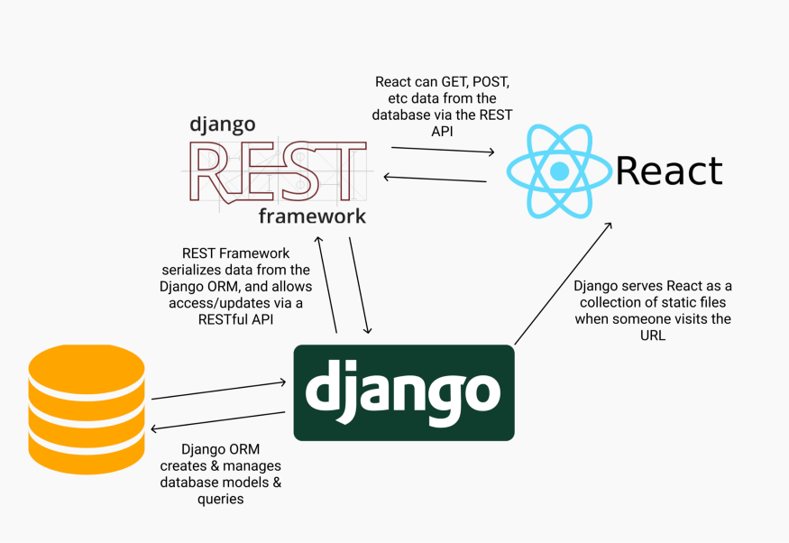

# Docker 

Docker is an open platform for developing, shipping, and running applications. Docker enables you to separate your applications from your infrastructure so you can deliver software quickly. With Docker, you can manage your infrastructure in the same ways you manage your applications. By taking advantage of Docker’s methodologies for shipping, testing, and deploying code quickly, you can significantly reduce the delay between writing code and running it in production.

## What can I use Docker for?

- Fast, consistent delivery of your applications

Docker streamlines the development lifecycle by allowing developers to work in standardized environments using local containers which provide your applications and services. Containers are great for continuous integration and continuous delivery (CI/CD) workflows.

- Responsive deployment and scaling

Docker’s container-based platform allows for highly portable workloads. Docker containers can run on a developer’s local laptop, on physical or virtual machines in a data center, on cloud providers, or in a mixture of environments.

Docker’s portability and lightweight nature also make it easy to dynamically manage workloads, scaling up or tearing down applications and services as business needs dictate, in near real time.

- Running more workloads on the same hardware

Docker is lightweight and fast. It provides a viable, cost-effective alternative to hypervisor-based virtual machines, so you can use more of your compute capacity to achieve your business goals. Docker is perfect for high density environments and for small and medium deployments where you need to do more with fewer resources.

## The underlying technology

Docker is written in the Go programming language and takes advantage of several features of the Linux kernel to deliver its functionality. Docker uses a technology called namespaces to provide the isolated workspace called the container. When you run a container, Docker creates a set of namespaces for that container.

## Django REST framework 

Django REST framework is a powerful and flexible toolkit for building Web APIs.

Some reasons you might want to use REST framework:

- The Web browsable API is a huge usability win for your developers.
- Authentication policies including packages for OAuth1a and OAuth2.
- Serialization that supports both ORM and non-ORM data sources.
- Customizable all the way down - just use regular function-based views if you don't need the more powerful features.
- Extensive documentation, and great community support.
- Used and trusted by internationally recognised companies including Mozilla, Red Hat, Heroku, and Eventbrite.

To-do list to create a REST API in Django

what are the steps to creating a REST API?

- Set up Django
- Create a model in the database that the Django ORM will manage
- Set up the Django REST Framework
- Serialize the model from step 2
- Create the URI endpoints to view the serialized data