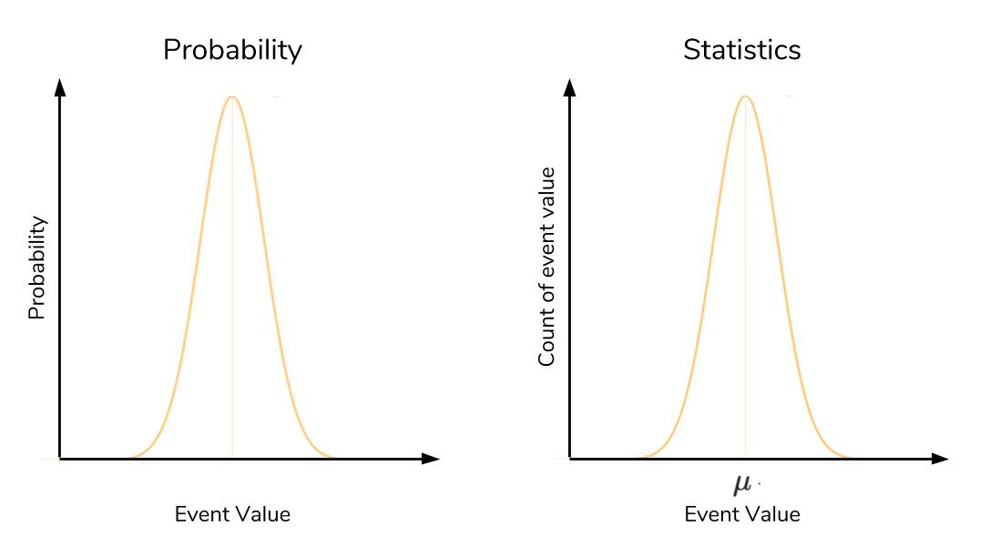

# Dunder Methods (magic method)
special methods in python are a set of predefined methods you can use to enrich your classes,Dunder methods let you emulate the behavior of built-in types and use them on objects.

- Initialization of new objects
To construct objects from a class you need a constructor which in Python is the __init__ dunder
- Object representation
provide a string representation of your object for the consumer of your class __repr__:The “official” string representation of an object/__str__:The “informal” or nicely printable string representation of an object
- Enable iteration
you can use these magic method to iterate inside objects
__len__, __getitem__, __reversed__
- Operator overloading (comparison)
you can use these magic method to compare two objects
__eq__, __lt__
- Operator overloading (addition)
you can use these magic method to add object to another object
__add__
- Callable Objects:
You can make an object callable like a regular function by adding
 __call__
- Context manager support
A context manager is a simple “protocol” (or interface) that your object needs to follow so it can be used with the with statement. Basically all you need to do is add __enter__ and __exit__ methods to an object if you want it to function as a context manager.

## probability
probability seeks to answer the question, “What is the chance of an event happening?” An event is some outcome of interest. To calculate the chance of an event happening, we also need to consider all the other events that can occur
Probability provides the theory, while statistics provides the tools to test that theory using data.

### The data and the distribution
The normal distribution refers to a particularly important phenomenon in the realm of probability and statistics

In a probability context, the high point in a normal distribution represents the event with the highest probability of occurring. As you get farther away from this event on either side, the probability drops rapidly, forming that familiar bell-shape. The high point in a statistical context actually represents the mean. As in probability, as you get farther from the mean, you rapidly drop off in frequency

### Central Limit Theorem

Central Limit Theorem lets us know that the average of many trials means will approach the true mean

### Three Sigma Rule

The Three Sigma rule, also known as the empirical rule or 68-95-99.7 rule, is an expression of how many of our observations fall within a certain distance of the mean

### Z-score

The Z-score is a simple calculation that answers the question, “Given a data point, how many standard deviations is it away from the mean?”

eq:

